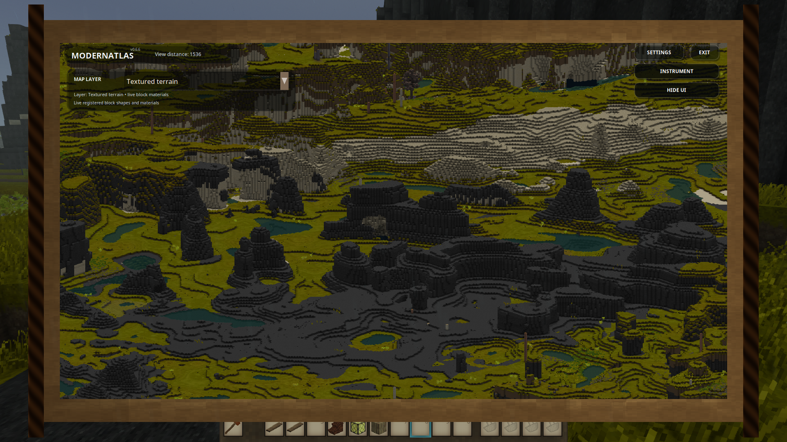
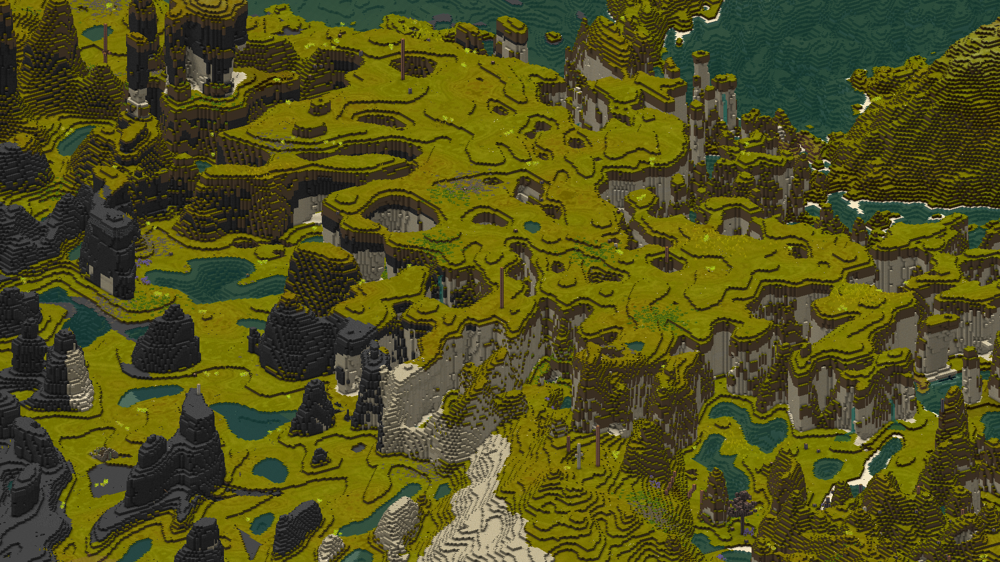
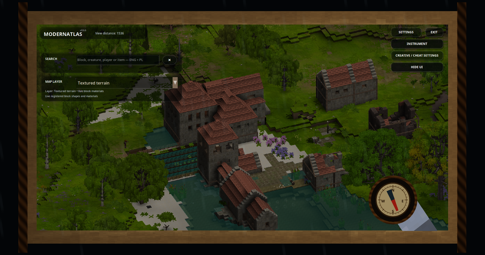

# ModernAtlas

ModernAtlas is an independent 3D world-map mod for **Vintage Story 1.22.3 or newer**.
Press `G` to open an interactive parchment atlas with terrain relief, water,
buildings, ruins, trees, climate layers, search tools and optional live-looking
clouds.

## How it works

ModernAtlas renders the exact block meshes and textures that Vintage Story has
already loaded on the client. Terrain and structures therefore appear on the
atlas as they appear in the world, including registered blocks and textures
from other mods. It does not generate unexplored terrain, request distant
chunks, replace the vanilla map or maintain a separate terrain cache.

Rendering and the interface run client-side. The optional server component
provides the authoritative multiplayer policy for already loaded living
entities and client Settings; ModernAtlas can also be used on the client when
a server does not install it.

When the server also installs ModernAtlas, it creates `ModernAtlasServer.json`
in the server configuration directory. `AllowClientSettings` defaults to
`true`; set it to `false` when the server owner wants to lock the ModernAtlas
Settings panel and its child panels for multiplayer players. This does not
change or delete a player's saved client configuration, and it does not stop
the atlas, `Hide` or `Exit`. Restart the server after changing this file.
Singleplayer always keeps Settings available.
Older servers and servers without the ModernAtlas policy channel leave this
non-sensitive client-only Settings access available; Cheat Mode and living
entity disclosure continue to use their separate safe defaults.

The generated server file has this shape (all values are explicit so an owner
can edit it without guessing which switch is the master):

```json
{
  "CheatModeAllowed": false,
  "LivingEntitiesEnabled": false,
  "AllowClientSettings": true,
  "AllowHideVegetation": true,
  "ShowPlayers": true,
  "ShowAnimals": true,
  "ShowMobs": true,
  "ShowNpcs": true,
  "PlayerOverrides": {}
}
```

An operator can manage the same values in game with `/ma admin`. The command
requires Vintage Story's `controlserver` privilege (included by the root/admin
role). The panel edits Server defaults and persistent per-player exceptions;
each player value can `Inherit`, `Deny` or `Allow` the corresponding default.
Exceptions are stored by stable player UID under `PlayerOverrides`, remain
available while that player is offline and are applied immediately without a
server restart. The server rechecks the operator privilege for every update;
the client panel is never treated as authority.

The administrator workflow has its own opt-in integration smoke test, separate
from the normal atlas renderer smoke:

```bash
bash scripts/run-admin-policy-smoke-test.sh
```

It requires disposable server and client data directories (defaulting to
`/tmp/modernatlas-policy-server` and `/tmp/modernatlas-policy-client`), an
existing server save, an empty `PlayerOverrides` object and one persisted
admin/root player. The script builds and installs the current package, launches
a dedicated server and multiplayer client, exercises Target, all seven policy
selectors, `Apply policy`, `Inherit all` and `Close`, reopens the panel, checks
the JSON and effective policy, then restores the original effective defaults
and exits cleanly. Override the fixture paths with
`MODERNATLAS_ADMIN_SMOKE_SERVER_DATA_PATH` and
`MODERNATLAS_ADMIN_SMOKE_CLIENT_DATA_PATH`. This test is intended for changes
to server policy, `/ma admin`, its protocol or GUI; it is deliberately not
called by `scripts/run-smoke-test.sh` after ordinary renderer changes.

`LivingEntitiesEnabled` is the master switch. The four `Show*` values then
allow or deny players, animals, hostile mobs and NPCs independently; clients
may hide an allowed category but cannot reveal a denied one. Keep
`CheatModeAllowed` false to disable the multiplayer spoiler tools, or set it to
`true` when `/ma cheat on` should be available. This authorizes ModernAtlas
Cheat Mode only; it does not change the world's actual Creative/Survival mode.
The admin panel labels this permission `Creative / Cheat atlas tools` because
it controls the atlas inspection, search, cave and ore tools that Creative
would expose in singleplayer. It never grants Vintage Story Creative mode or
changes `AllowCreativeMode`.
`AllowClientSettings` controls the client Settings hierarchy and `/ma low` or
`/ma high` preset delivery. These server commands require the normal `chat`
privilege, so every player with that privilege can request the setting for
their own client; restrict that privilege through the server roles if only
administrators should use them. `/ma cheat off` remains available as a safe
way to revoke a grant. The local `.ma low` and `.ma high` commands are
client-only alternatives when Settings are allowed.
`AllowHideVegetation` independently controls whether multiplayer clients may
hide registered plants, bushes and leaves in the atlas. Set it to `false` to
keep vegetation visible for every player. The control then reads
`Disabled by server policy`, and the Low preset leaves the player's saved
vegetation preference unchanged while rendering vegetation normally.

In multiplayer, the server packet is authoritative for Cheat Mode, living
entity disclosure and the Settings lock. A matching ModernAtlas channel is
latched for the world session and Settings remain closed until its packet
arrives. Editing `CheatModeByWorld` or other permission-looking values in the
client's `ModernAtlas.json` cannot grant Cheat Mode or reveal an entity
category denied by the server. A multiplayer Cheat Mode enable request is
accepted only after the client has received an explicit server grant.
The new Settings-lock field is enforced by current ModernAtlas clients; an
older client can still open its legacy Settings UI because it cannot understand
that optional packet field, so require the current client version when the lock
is part of the server's rules.

## Screenshots







The atlas screenshot panel offers independent `Resolution` (1x-8x) and
`Capture area` (100%, 75%, 50% or 25%) choices. The area is a centered crop of
the live view, while the PNG dimensions stay tied to the selected resolution;
the preview shows the final dimensions, megapixels and effective detail. A
100 MP safety budget prevents extreme captures from exhausting memory and the
preview warns when a requested result will be downsampled.

Large captures use an isolated ModernAtlas job directory under the game's
`ModData` path. A small JSON manifest records the selected settings, dimensions,
paths and capture stage, while each captured pixel tile is staged in its own
binary file rather than in JSON. The stitched image is written to a private
`*.png.part`, structurally validated, and moved atomically into
`Screenshots/ModernAtlas` only after the PNG stream closes successfully. The
public screenshot folder therefore contains completed PNG files only; manifests,
tiles and partial files are removed from the exact job directory after success
or cancellation.

The opt-in automated smoke path can run the consecutive regression sequence
with `MODERNATLAS_SMOKE_SCREENSHOT_SEQUENCE=1`; it captures 1x/25% followed by
8x/25% in one session. `MODERNATLAS_SMOKE_SCREENSHOT_CANCEL=1` instead closes
the progress modal during stitching and verifies that the cancelled job leaves
neither a PNG nor a public sidecar.

The automated smoke test targets the existing standard generated world
`arcyliszs cave world` by default. Run it with `bash scripts/run-smoke-test.sh`;
set `MODERNATLAS_SMOKE_WORLD` to select another standard test world. The
superflat `TESTCREATIVE` world is not a valid rendering regression target.

## Installation

Place the ModernAtlas release ZIP in the Vintage Story `Mods` directory. Keep
the ZIP packed, start Vintage Story 1.22.3 or newer and press `G` in a loaded world.

## AI disclosure

ModernAtlas is a project by **Arcylisz**, created with code and documentation
assistance from **ChatGPT**, an AI system by OpenAI. The project remains under
human direction and review.

## License and trademarks

The original ModernAtlas source code is available under the [MIT License](LICENSE).
See [NOTICE.md](NOTICE.md) for attribution, independence and trademark details.
Vintage Story is required separately; no game binaries, assets or map data are
redistributed by this repository. ModernAtlas is not affiliated with or
endorsed by Anego Studios or OpenAI.
